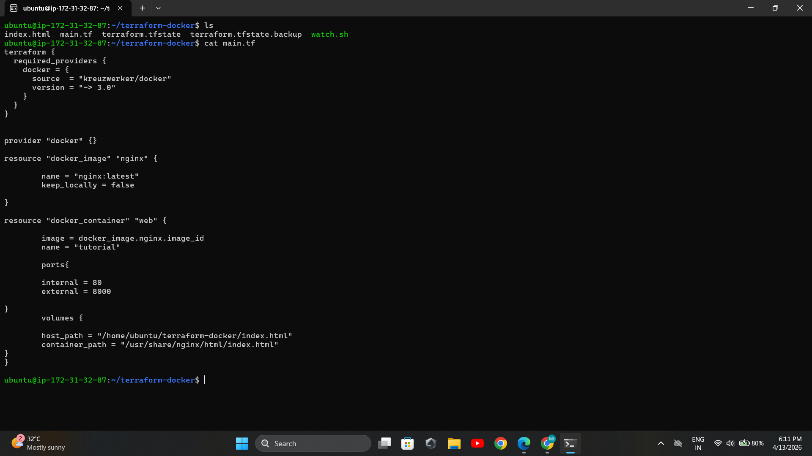
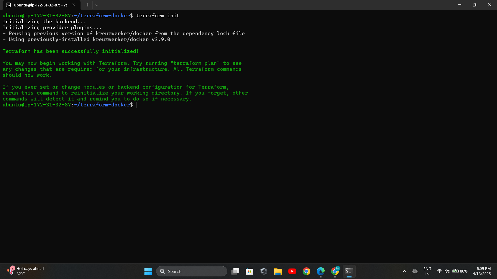
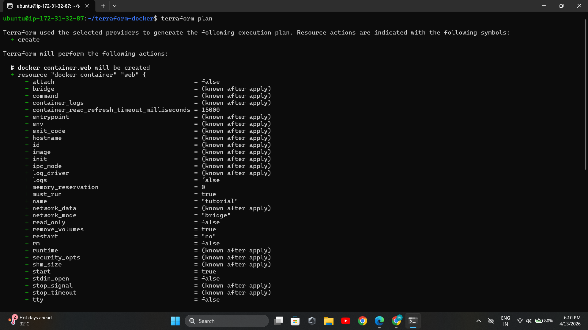
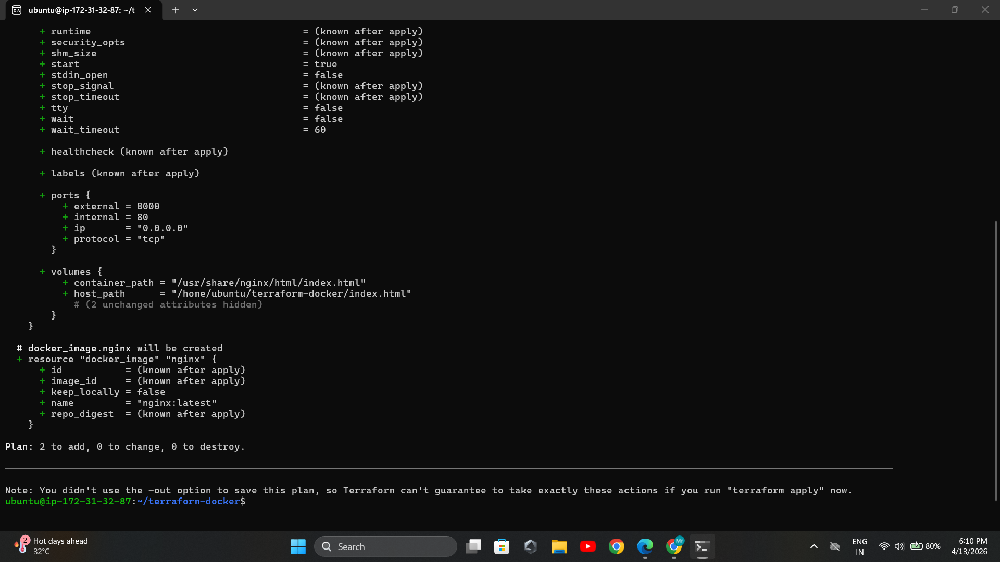
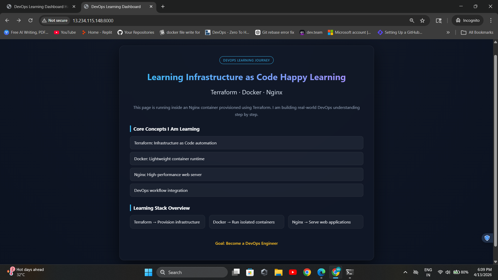

# 🚀 Terraform IaC with Docker (Beginner Guide)

## 📌 What I Learned

In this project, I learned how to use Terraform to provision infrastructure using code (Infrastructure as Code).

I understood how we can automatically create and manage a Docker container without manual setup. This helped me learn how DevOps engineers manage infrastructure efficiently and consistently.

---

## 📌 Project Overview

This project demonstrates how to use Terraform to create and run a Docker container locally.

The goal is to understand Infrastructure as Code (IaC) in a simple and practical way using Terraform and Docker.

---

## 🛠 Tools Used

* Terraform
* Docker

---

## 📂 Project Structure

```bash
Iac-terraform-practice/
├── main.tf
├── asset/
│   └── (task:output)
├── README.md
```

---

## ⚙️ Prerequisites

Make sure you have:

* Terraform installed
* Docker installed and running

---

## 🔧 Step 1: Write Terraform Configuration

Create a `main.tf` file:


```

```

---

## 🔧 Step 2: Initialize Terraform

```bash
terraform init
```

### 📸 Output Screenshot



---

## 🔧 Step 3: Check Execution Plan

```bash
terraform plan
```

### 📸 Output Screenshot



---

## 🔧 Step 4: Apply Configuration

```bash
terraform apply
```

Type `yes` when prompted.

### 📸 Output Screenshot



---

## 🔧 Step 5: Verify Running Container

```bash
docker ps
```

---

## 🔧 Step 6: Access the Application

Open in browser:



```
http://<EC2-ip>:8080 or http://localhost:8080 
```

---

## 🔧 Step 7: Destroy Infrastructure

```bash
terraform destroy
```

This will remove the container and clean up resources.

---

##  Step 8: Terraform Plan Symbols Guide
When using Terraform, especially during `terraform plan` or `terraform apply`, you’ll see symbols like `+`, `-`, `~`, etc. These indicate what changes Terraform will make to your infrastructure.

| Symbol | Meaning            | Action                   |
| ------ | ------------------ | ------------------------ |
| `+`    | Create             | New resource added       |
| `-`    | Destroy            | Resource removed         |
| `~`    | Update             | Modify existing resource |
| `-/+`  | Recreate           | Destroy and create again |
| `<=`   | Read (data source) | Fetch external data      |


```bash
Terraform will perform the following actions:

  + aws_instance.new
  ~ aws_instance.existing
  - aws_instance.old

Plan: 1 to add, 1 to change, 1 to destroy.
```

This will remove the container and clean up resources.

---

## 🎯 Result

* Docker container is created using Terraform
* Infrastructure is managed using code
* Basic IaC workflow is working successfully

---

## ❓ Key Concepts

### 🔹 What is IaC?

Infrastructure as Code (IaC) means managing infrastructure using code instead of manual setup.

---

### 🔹 How Terraform Works

Terraform uses configuration files (`.tf`) to define infrastructure and automatically provisions it.

---

### 🔹 Terraform State File

The state file keeps track of resources Terraform manages.

---

### 🔹 Plan vs Apply

* `terraform plan` → shows what will change
* `terraform apply` → actually creates resources

---

### 🔹 Terraform Providers

Providers are plugins that allow Terraform to interact with platforms like Docker, AWS, etc.

---

## 🚀 Conclusion

This task helped me understand how infrastructure can be automated using Terraform.

It gave me practical experience with IaC and improved my understanding of DevOps workflows.
